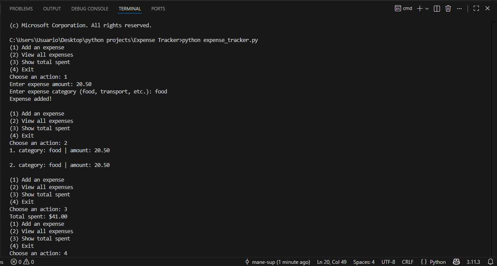
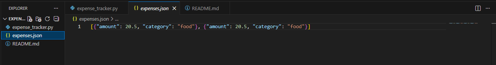

# Expense Tracker

A Python-based terminal program that allows users to track daily expenses by adding amounts and categories, view all expenses, and calculate total spending. Expenses are stored in a JSON file for persistent storage across sessions.

This project demonstrates:

- Adding and managing expenses
- Storing data persistently with JSON
- Simple terminal-based menu interaction
- Summing and displaying totals
- Beginner-friendly file handling in Python

## Features

- Add new expenses with amount and category
- View all expenses in a numbered, organized list
- Show total spent across all expenses
- Persistent storage using expenses.json
- Clean terminal interface for easy tracking

## How to Run

1. Make sure Python 3 is installed
2. Open the terminal in the project folder
3. Run the program:

```bash
python expense_tracker.py
```

Follow the prompts:

- Add an expense (choose 1)
- View all expenses (choose 2)
- Show total spent (choose 3)
- Exit program (choose 4)

## Example Run
<pre> 
(1) Add an expense 
(2) View all expenses 
(3) Show total spent 
(4) Exit Choose an action: 1 
Enter expense amount: 20.50 
Enter expense category (food, transport, etc.): Food 
Expense added! 
(1) Add an expense 
(2) View all expenses 
(3) Show total spent 
(4) Exit Choose an action: 2 
1 category: Food | amount: $20.50 
(1) Add an expense 
(2) View all expenses 
(3) Show total spent 
(4) Exit 
Choose an action: 3 
Total spent: $20.50 
</pre>

## Example
Below is an example run in the terminal: 



Screenshot of JSON file:



## About

This project is part of my Python learning journey, demonstrating practical programming, file management with JSON, and beginner-friendly interactive terminal coding.

It’s designed as a portfolio project to showcase programming skills, logical thinking, and working with persistent data.